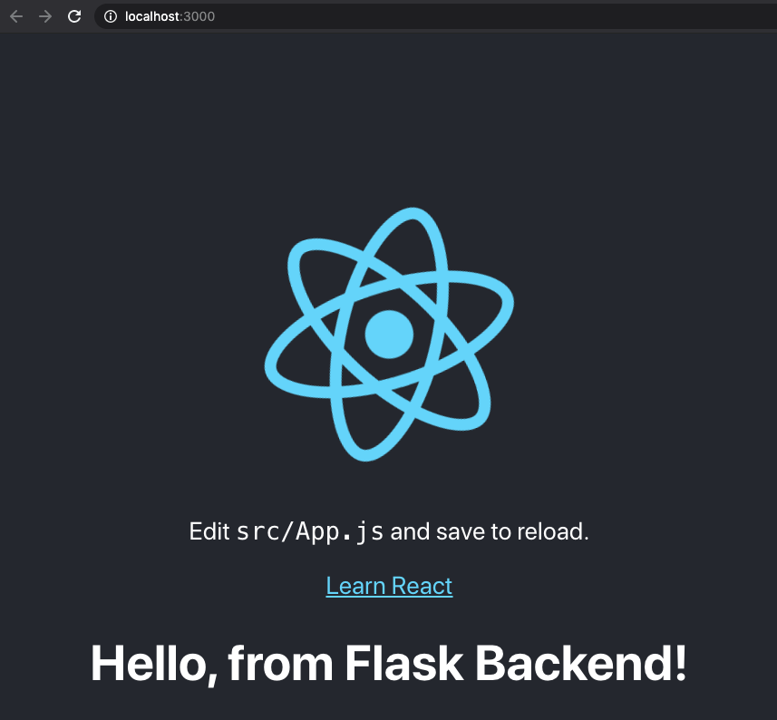

# flask-react-boilerplate

Boilerplate repo for a Flask app using React as a Frontend

## Presentation Materials

[Follow along with the slides here](https://docs.google.com/presentation/d/1qD9vvtMGnLPO9869TmInR7cUUZJduvpO8zR2z1Fh5Jw/edit?usp=sharing)

[Future Video Link](http://alanswenson.dev)

## Install

This is install instruction for the boilerplate, if you want to start from scratch follow the presentation instead:

You need:

- Python 3
- NodeJS
- Yarn

```shell
git clone <repo>
cd flask-react-boilerplate
pip install pipenv
pipenv shell
pipenv install
```

## Run

```shell
pipenv shell (if not still in shell from step above)
make backend
```

In a separate terminal  

```shell
cd flask-react-boilerplate
make init
make frontend
```

[http://localhost:3000](http://localhost:3000) should look like this~!

